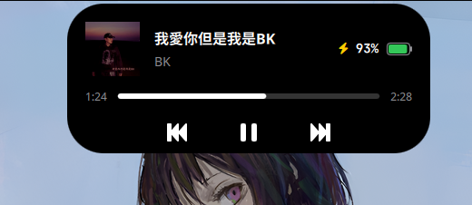
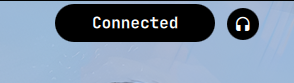
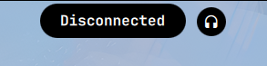

# Dynamic-island-on-hyprland
- Dynamic Island is a smooth, flexible, and fast interactive island component designed for Hyprland users.

- Based on Quickshell and C++ /Qt 6.

- Pursuting lightweight, smooth anim, and low-latency performance. 
### usage:

Memory usage: < 100 Mb (PSS)

CPU usage < 2%

## Description:


Video: https://www.youtube.com/watch?v=SAc6_1Y7QJc


#### Clock Mode

<div align="left">
  
</div>

#### System Notifications

<div align="left">
  
</div>

####  Workspace Indicator

<div align="left">
  
</div>

#### Lyrics

<div align="left">
  
</div>

#### Control Center

<div align="left">
  
</div>


####  Music Player
<div align="left">
  
</div>

####  Workspace overview
<div align="left">
  
</div>

### Dependencies:

#### Build-time Dependencies (Compiling the backend)
- CMake (>= 3.16)

- C++17 Compiler (GCC or Clang)

- Qt6 SDK: Specifically Core, Qml, Network, and DBus modules

- libudev-dev: Required for monitoring battery status via udev

#### Runtime Environment

- Hyprland

- Quickshell

- pactl

- wpctl

- UPower DBus service and access to /sys/class/power_supply

#### Assets & Scripts

- JetBrainsMono Nerd Font (For icons and mono text)

- Inter & Inter Display (For UI text)

- custom scripts

>Please rewrite the script path in UserConfig.qml

### Compile & run:

- Download 
```bash
git clone https://github.com/enhaoswen/Dynamic-Island-on-Hyprland.git && cd Dynamic-Island-on-Hyprland
```

> make sure you change the program if is necessary, check important things at the end.


- Build 

```bash
mkdir -p build && cd build && cmake .. && make -j$(nproc)
mkdir -p ~/.config/quickshell/dynamic_island
mv *.so qmldir ~/.config/quickshell/dynamic_island/
cp ../*.qml ~/.config/quickshell/dynamic_island/
```

- Clean 

```bash
cd ../.. && rm -rf Dynamic-Island-on-Hyprland
```

- To run in Hyprland:
```bash
QML2_IMPORT_PATH=~/.config/quickshell quickshell -p ~/.config/quickshell/dynamic_island/main.qml
```
## Acknowledgments

- [@end-4](https://github.com/end-4) - For the workspace overview design.
- [@BEST8OY](https://github.com/BEST8OY) - For providing the lyrics support.
- 淮南牛肉粉丝 - For being so delicious.

## Important thing

- **For custom scripts, please make your own and change the path in UserConfig.qml**

- **The backend is hardcoded to read /sys/class/backlight/intel_backlight/. If you are using AMD or a different backlight driver, please update the path (SysBackend.cpp:353).**

- **The status of caps lock is currently polled via hyprctl devices. Ensure hyprctl is in your $PATH.**

